<h1 align="center">🌟 Práctica 3 - Visión por Computador (Curso 2024/2025)</h1>

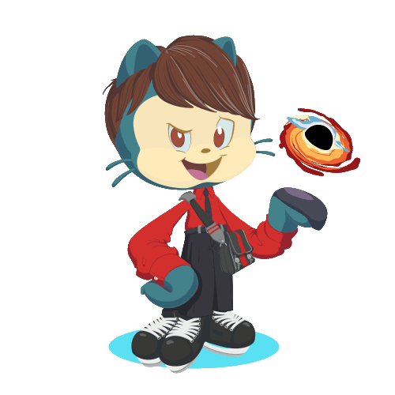</a>
Se han completado todas las tareas solicitadas de la **Práctica 3** para la asignatura **Visión por Computador**. Detección de formas.

*Trabajo realizado por*:

[](https://github.com/kratoscordoba7)

[](https://github.com/AlejandroDavidArzolaSaavedra)

## 🛠️ Librerías Utilizadas

[](Link_To_Your_NumPy_Page)
[](Link_To_Your_OpenCV_Page)
[](Link_To_Your_Matplotlib_Page)
[](Link_To_Your_ScikitLearn_Page)
[](Link_To_Your_Seaborn_Page)

---
## 🚀 Cómo empezar

Para comenzar con el proyecto, sigue estos pasos:

> [!NOTE]  
> Debes situarte en un environment configurado como se definió en el cuaderno de la práctica 1 de [otsedom](https://github.com/otsedom/otsedom.github.io/blob/main/VC/P1/README.md#111-comandos-basicos-de-anaconda) y el de la práctica 3 de [otsedom](https://github.com/otsedom/otsedom.github.io/blob/main/VC/P3/README.md).

### Paso 1: Abrir VSCode y situarse en el directorio:
   
   ```bash
   C:\Users\TuNombreDeUsuario\anaconda3\envs\VCP3
   ```

### Paso 2: Clonar y trabajar en el proyecto localmente (VS Code)
1. **Clona el repositorio**: Ejecuta el siguiente comando en tu terminal para clonar el repositorio:
   ```bash
   git clone https://github.com/kratoscordoba7/VCP3.git
   ```
2. Una vez clonado, todos los archivos han de estar situados en el environment del paso 1

### Paso 3: Abrir Anaconda prompt y activar el enviroment:
   ```bash
   conda activate NombreDeTuEnvironment
   ```
Tras estos pasos debería poder ejecutar el proyecto localmente

---

<h2 align="center">📋 Tareas</h2>

### Tarea 1 Detectar monedas

Todos los objetos de interés en la imagen son circulares, en concreto monedas de la UE. Tras mostrar diversas aproximaciones para obtener sus contornos, el reto o tarea consiste en determinar la cantidad de dinero presente en la imagen.

Comenzamos con una primera aproximación basada en los diámetros estándar de las monedas de la UE. Utilizamos la transformada de Hough para detectar círculos en la imagen. En esta etapa inicial, el usuario puede hacer clic en cualquier moneda dentro de la imagen para identificarla. Por ejemplo, en la siguiente imagen:

<div align="center">
   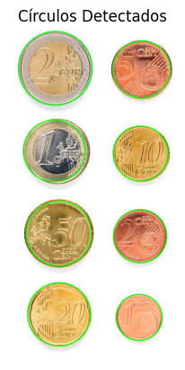
</div>

En este caso, el usuario ha seleccionado la moneda de 1 euro, y la información que se muestra es la siguiente:

- Número de monedas en la imagen: 8
- Diámetro seleccionado en milímetros: 22.27
- Diámetro seleccionado en píxeles: 175
- Moneda identificada: 1 euro

> [!IMPORTANT]  
> Es importante tener en cuenta que las fotos pueden tomarse a diferentes distancias de las monedas, por lo que las medidas obtenidas son aproximadas y pueden no ser exactas. Aunque el modelo funciona bien en este caso específico, su precisión depende de la calidad de la foto y de las circunstancias en las que fue tomada, siendo más efectivo en imágenes con poco ruido.

Un fragmento del código utilizado para identificar la moneda se basa en la comparación entre el diámetro estándar y el diámetro detectado en la imagen. El algoritmo realiza una búsqueda simple que compara el diámetro medido en la imagen con el estandar de la UE. La moneda con la menor diferencia es considerada la más probable.

```python
def identificar_moneda(diametro_mm):
    moneda_mas_cercana = None
    diferencia_minima = float('inf') 
    for nombre, info in monedas_info.items():
        diferencia = abs(diametro_mm - info["diámetro"])
        if diferencia < diferencia_minima:
            diferencia_minima = diferencia
            moneda_mas_cercana = nombre
    return moneda_mas_cercana
```

Como siguiente paso, queremos que el sistema no solo sea capaz de diferenciar las monedas, sino que también calcule el valor total de las mismas, similar al funcionamiento de un cajero automático. En la siguiente imagen se puede ver este proceso en acción:

<div align="center">
   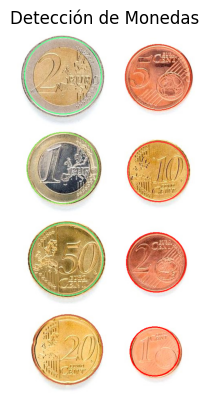
</div>

El resultado obtenido fue el siguiente:

- Número de monedas: 8
- Valor total: 3,88 €

> [!IMPORTANT]  
> La imagen utilizada tiene un fondo blanco y se tomó desde un ángulo favorable y a una distancia cercana, lo que permite obtener un resultado muy preciso en este caso.

A continuación, se muestra un fragmento de la función que identifica las monedas utilizando la transformada de Hough y un filtro Gaussian Blur:

```python
def identificar_moneda(dir_img, moneda, todas):
    cont = 0
    total_valor = 0.0
    
    img = cv2.imread(dir_img)
    img_rgb = cv2.cvtColor(img, cv2.COLOR_BGR2RGB)
    
    # Conversión a escala de grises y suavizado
    gris = cv2.cvtColor(img, cv2.COLOR_BGR2GRAY)
    pimg = cv2.GaussianBlur(gris, (5, 5), 1)
    
    # Detección de círculos
    circ = cv2.HoughCircles(
        pimg, 
        cv2.HOUGH_GRADIENT, 
        dp=1, 
        minDist=80, 
        param1=70, 
        param2=70, 
        minRadius=0, 
        maxRadius=100
    )
```

Sin embargo, al probar en otros casos, se producen efectos no deseados, como se muestra en las siguientes imágenes:

<div align="center">
   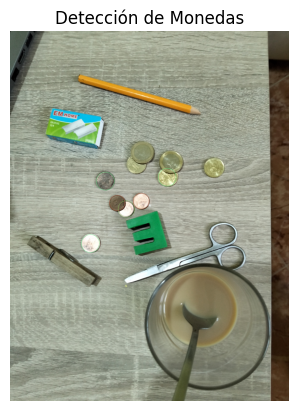
   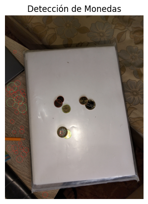
</div>

El resultado de la imagen de la izquierda fue:

- Número de monedas: 7
- Valor total: 7,40 €

El resultado de la imagen de la derecha fue:

- Número de monedas: 39
- Valor total: 8,81 €

> [!TIP]  
> Como se puede observar, estos resultados no coinciden con las imágenes mostradas, indicando que el sistema presenta errores. Por ejemplo, las monedas superpuestas no se detectan correctamente, y los valores calculados pueden ser excesivos o no representar la realidad. Por lo tanto, se evaluará la implementación de un modelo más preciso para mejorar la detección y el cálculo.

La última mejora implementada para detectar las monedas, especialmente las que están superpuestas, consistió en optimizar la transformada de Hough y ajustar el algoritmo original. Se utilizó el radio esperado de cada moneda con una cierta tolerancia para comparar el radio detectado, lo que permitió desarrollar un modelo más preciso, como se muestra en las siguientes imágenes:

<div align="center">
   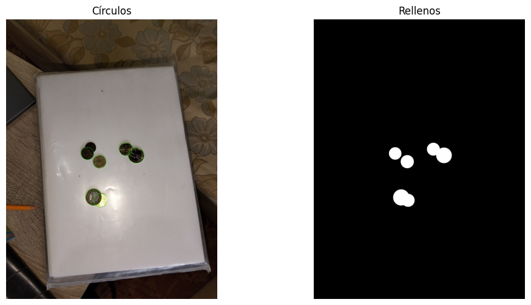
</div>

El resultado obtenido fue:

Se detectaron 6 círculos en la imagen.
- Centro (píxeles): (1740, 1894)
- Radio (píxeles): 94
- Diámetro (píxeles): 188
Monedas:
- 1 euro
- 0.50 céntimos
- 0.20 céntimos
- 1 euro
Total: 2.7 €

<div align="center">
   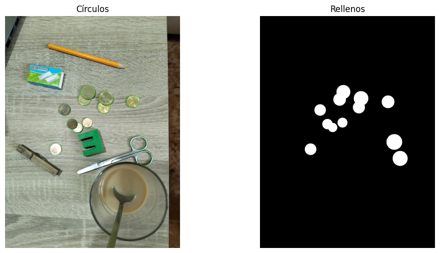
</div>

El resultado obtenido fue:

Se detectaron 12 círculos en la imagen.
- Centro (píxeles): (1736, 1606)
- Radio (píxeles): 106
- Diámetro (píxeles): 212
- Radio seleccionado: 106
Monedas:
- 0.20 céntimos
- 0.20 céntimos
- 1 euro
- 0.10 céntimos
- 0.02 céntimos
- 0.50 céntimos
- 0.50 céntimos
Total: 2.52 €

> [!IMPORTANT]  
> Aunque este modelo no es completamente preciso, es mucho más eficiente, logrando detectar monedas superpuestas y acercarse al valor real de las monedas en diferentes fotos, incluso en situaciones complejas y desfavorables.

A continuación, se muestra un fragmento del código que se encarga de identificar las monedas:

```python
    def identify_coin(self, moneda=None, todas=True):
        """Identifica y suma el valor de las monedas detectadas."""
        if self.circles is None:
            print("No hay círculos detectados para identificar.")
            return

        suma = 0.0
        tolerancia = 2.25  # Tolerancia para la identificación de monedas

        if self.selected_circle is None:
            print("No se ha seleccionado ningún círculo.")
            return

        radio_seleccionado = self.selected_circle[2]
        print(f"Radio seleccionado: {radio_seleccionado}")

        coin_values = [
            {"name": "0.01", "factor": 8.13},
            {"name": "0.02", "factor": 9.375},
            {"name": "0.05", "factor": 10.625},
            {"name": "0.10", "factor": 9.875},
            {"name": "0.20", "factor": 11.125},
            {"name": "0.50", "factor": 12.125},
            {"name": "1", "factor": 11.625},
            {"name": "2", "factor": 12.875},
        ]

        for det in self.circles[0]:
            _, _, det_radio = det
            for coin in coin_values:
                expected_radius = (coin["factor"] * radio_seleccionado) / 11.625
                if abs(det_radio - expected_radius) <= tolerancia:
                    value = float(coin["name"])
                    if (moneda == coin["name"] or todas):
                        suma += value
                        print(f"{coin['name']} céntimos" if value < 1 else f"{int(value)} euro{'s' if value > 1 else ''}")
                    break  
```

Gracias a este enfoque, se obtiene una aproximación más precisa en el cálculo del valor total de las monedas en condiciones del mundo real.


### Tarea 2 Detectar microplasticos

Para la segunda tarea, se proporcionan tres subimágenes de tres clases de microplásticos recogidos en playas canarias. La tarea propuesta consiste en determinar patrones en sus características geométricas que puedan permitir su clasificación en dichas imágenes y otras. Como fuente de partida, se proporciona enlace al trabajo [SMACC: A System for Microplastics Automatic Counting and Classification](https://doi.org/10.1109/ACCESS.2020.2970498) en el que se adoptan algunas propiedades geométricas para dicho fin. De forma resumida, las características geométricas utilizadas en dicho trabajo fueron:

- Área en píxeles
- Perímetro en píxeles
- Compacidad (relación del cuadrado del perímetro con el área)
- Relación del área con la del contenedor
- Relación del ancho y el alto del contenedor
- Relación entre los ejes de la elipse ajustada
- Definido el centroide, relación entre las distancias menor y mayor al contorno

## Explicación

Para completar esta tarea se ha utilizado un modelo SVC predictivo sin redes neuronales. El funcionamiento de este modelo es simple y el procedimiento que se siguió fue el siguiente:
   - En primer lugar se entrenó al modelo SVC con datos de las imágenes de prueba, estas imágenes son las denominadas FRA, PEL y TAR. El entrenamiento consiste en umbralizar las imágenes para segmentar las partículas del fondo extrayendo posteriormente datos relevantes como su área, perímetro, f1score (relación altura/anchura), media del color. Tras obtener el modelo los datos de todos los ejemplos posibles (FRA, PEL y TAR) se le manda las imágenes de test para que prediga qué tipo es. A continuación se muestran los contornos que detecta el modelo durante el análisis de las partículas.


<table>
    <td width="50%">
        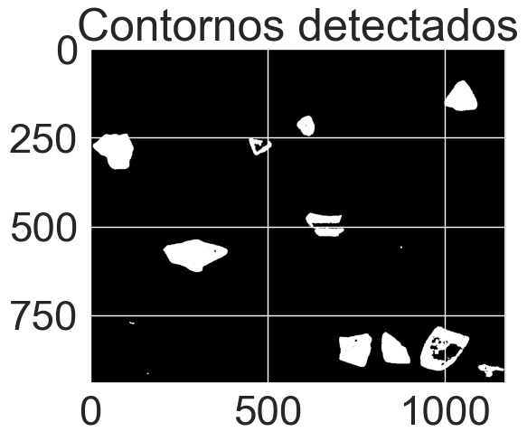
    </td>
    <td width="50%">
        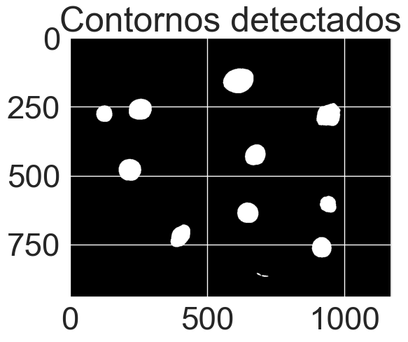
    </td>
</table>

<table>
    <td width="50%">
        
    </td>
    <td width="50%">
        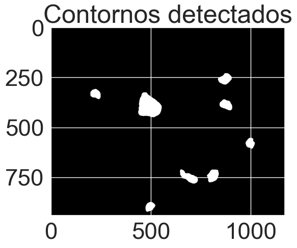
    </td>
</table>

<table align="center">
    <div align="center">
        <td width="100%">
            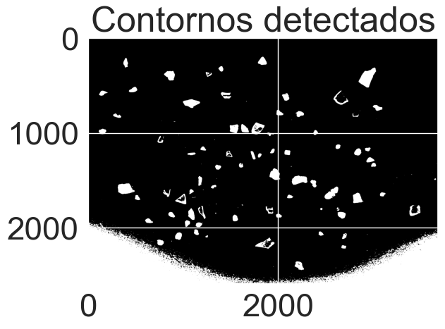
        </td>
    </div>
</table>                                   


El código se divide en las siguientes secciones:

``` python
def preprocess_and_segment(img):
    # Aplicar un filtro de mediana
    img_blur = cv2.GaussianBlur(img, (5,5), 0)

    # Aplicar umbralización adaptativa
    _, thresh = cv2.threshold(img_blur,0,255,cv2.THRESH_BINARY_INV+cv2.THRESH_OTSU)

    # Extraer los contornos
    contours, _= cv2.findContours(thresh, cv2.RETR_EXTERNAL , cv2.CHAIN_APPROX_SIMPLE)

    # Filtrar contornos por área para eliminar ruido
    contours = [c for c in contours if cv2.contourArea(c) > 100]  # Ajusta este valor según tus datos
    
        # Visualizar contornos
    for contour in contours:
        cv2.drawContours(thresh, [contour], -1, (255, 0, 0), 2)  # Dibuja contornos en rojo   
    plt.imshow(thresh, cmap='gray')
    plt.title('Contornos detectados')
    plt.show()
    
    return contours
```
Esta función umbraliza la imagen y extrae los contornos que serán analizados para obtener datos por esta sección de código


```python
def extract_features(contour, img_color):
    features = {}
    
    # Calcular características geométricas clave
    area = cv2.contourArea(contour)
    perimeter = cv2.arcLength(contour, True)
    compactness = (perimeter ** 2) / area if area > 0 else 0

    # Usar boundingRect para calcular el aspect ratio
    _, __, w, h = cv2.boundingRect(contour)
    aspect_ratio = float(w) / h if h > 0 else 0

    # Calcular el color medio de la partícula usando el contorno
    mask = np.zeros(img_color.shape[:2], dtype=np.uint8)  # Crear una máscara en blanco
    cv2.drawContours(mask, [contour], -1, 255, -1)  # Dibujar el contorno en la máscara
    mean_color = cv2.mean(img_color, mask=mask)  # Obtener el color medio (BGR)
    
    isBlack = 1 if ((mean_color[0] + mean_color[1] + mean_color[2]) // 3) <= 30 else 0 
    # Guardar las características clave, incluyendo el color medio
    features['area'] = area
    features['perimeter'] = perimeter
    features['compactness'] = compactness
    features['aspect_ratio'] = aspect_ratio
    features['mean_color_B'] = isBlack

    # Retornar todas las características como un array plano
    return list(features.values())
```

La última función que se usa en el código es la que se toma cuando se prueba el modelo tras haber sido entrenado y esa función es:

```python
# Función para clasificar partículas y evaluar el resultado
def classify_and_evaluate(X_train, y_train, X_test, y_test):
    # Usar imputer para manejar valores NaN
    imputer = SimpleImputer(strategy='mean')
    X_train = imputer.fit_transform(X_train)
    X_test = imputer.transform(X_test)
    
    # Crear y entrenar el modelo SVM
    model = SVC()
    model.fit(X_train, y_train)

    # Hacer predicciones
    y_pred = model.predict(X_test)

    # Mostrar el número de partículas clasificadas en cada clase
    unique, counts = np.unique(y_pred, return_counts=True)

    # Evaluar el rendimiento del modelo usando las métricas
    accuracy = accuracy_score(y_test, y_pred)
    precision = precision_score(y_test, y_pred, average='weighted', zero_division=0)
    recall = recall_score(y_test, y_pred, average='weighted', zero_division=0)
    f1score = f1_score(y_test, y_pred, average='weighted', zero_division=0)

    print(f"Accuracy: {accuracy:.2f}")
    print(f"Precision: {precision:.2f}")
    print(f"Recall: {recall:.2f}")
    print(f"F1 Score: {f1score:.2f}")

    # Matriz de confusión
    conf_matrix = confusion_matrix(y_test, y_pred)
    plt.figure(figsize=(8,8))
    sns.set(font_scale = 1.75)#tamaños tipografía
    sns.set(font_scale = 3.0)

    ax = sns.heatmap(
            conf_matrix, # confusion matrix 2D array 
            annot=True, # Muestra números en las celdas
            fmt='d', # valores enteros
            cbar=False, # sin barra de colores
            cmap='flag', # mapa de colores
            #vmax=175 # contraste de color
        )

    #Etiquetas matriz de confusión
    label_font = {'size':'25'}
    ax.set_xlabel("Predicha", labelpad=-0.75, fontdict=label_font)
    ax.set_ylabel("Real/Anotado", labelpad=20, fontdict=label_font)
    
    #print("Matriz de confusión:")
    #print(conf_matrix)
    print("------------------------------------------")
```

El segmento de código que cohesiona estas funciones es: 

```python
# Zona entrenamiento
image_paths_train = ["FRA.png", "PEL.png", "TAR.png"]
labels_train = [1, 2, 3]
X_train = []
y_train = []

for img_path, label in zip(image_paths_train, labels_train):
    # Leer la imagen en escala de grises
    img = cv2.imread(img_path, cv2.IMREAD_GRAYSCALE)
    contours = preprocess_and_segment(img)
    for contour in contours:
        features = extract_features(contour, img)
        if not any(np.isnan(features)) and not any(np.isinf(features)):
            X_train.append(features)
            y_train.append(label)

# Zona test
# Procesar la imagen de prueba
image_paths_test = ["uno.JPG", "dos.JPG", "tres.JPG"]
X_test = []
X_tests = []
y_test = [[1] * 80, [2] * 54, [3] * 54]
contador = 0

# Enmascarar la imagen, hacer un AND con la imagen original suma de los valores en promedio con el área y calculo color, si no es oscuro no es 3
# Extraer características geométricas de la imagen de prueba
for index in range(len(image_paths_test)):
    # Leer la imagen en escala de grises
    img = cv2.imread(image_paths_test[index], cv2.IMREAD_GRAYSCALE)
    
    # Obtener el tamaño de la imagen
    height, width = img.shape   
    y1, y2, x1, x2 = int(0.05 * height), int(0.80 * height), int(0.15 * width), int(0.95 * width)
    
    # Imagen recortada
    img_mod = img[y1:y2, x1:x2]
    contours = preprocess_and_segment(img_mod)
    
    for contour in contours:
        # print(f'Contorno = {contour}')
        features = extract_features(contour, img)
        contador += 1
        if not any(np.isnan(list(features))) and not any(np.isinf(list(features))) and len(X_test) < len(y_test[index]): X_test.append(features)
    
    X_tests.append(X_test)
    X_test = []
    
    if len(X_tests[index]) == 0:
        print("No se encontraron partículas en la imagen de prueba.")
    else:
        # Clasificar las partículas y evaluar el modelo
        classify_and_evaluate(X_train, y_train, X_tests[index], y_test[index])
```

Por último, se adjunta la imagen que corresponde a las matriz de confusión que se generaro en la función classify_and_evaluate(X_train, y_train, X_test, y_test)

<div align="center">
   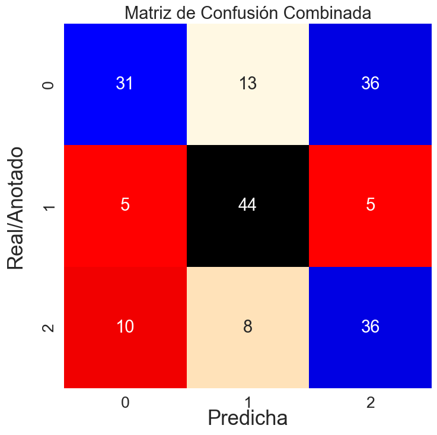
</div>

---

> [!IMPORTANT]  
> Los archivos presentados aquí son una modificación de los archivos originales de [otsedom](https://github.com/otsedom/otsedom.github.io/tree/main/VC).


---

## 📚 Bibliografía

1. [Opencv](https://docs.opencv.org/4.x/dc/da5/tutorial_py_drawing_functions.html)
2. [Opencv Hough circles](https://docs.opencv.org/4.x/da/d53/tutorial_py_houghcircles.html)
3. [StackOverflow how to improve accuracy](https://stackoverflow.com/questions/70659992/how-to-improve-accuracy-of-cv2s-houghcircles)
4. [Opencv tutorial Hough circle](https://docs.opencv.org/4.x/d4/d70/tutorial_hough_circle.html)
5. [THRESH OTSU OPENCV](https://docs.opencv.org/4.x/d7/d4d/tutorial_py_thresholding.html)
6. [Scikit-learn SVC](https://scikit-learn.org/dev/modules/generated/sklearn.svm.SVC.html)
7. [Seaborn heatmap](https://seaborn.pydata.org/generated/seaborn.heatmap.html)

---

**Universidad de Las Palmas de Gran Canaria**  

EII - Grado de Ingeniería Informática  
Obra bajo licencia de Creative Commons Reconocimiento - No Comercial 4.0 Internacional

---
